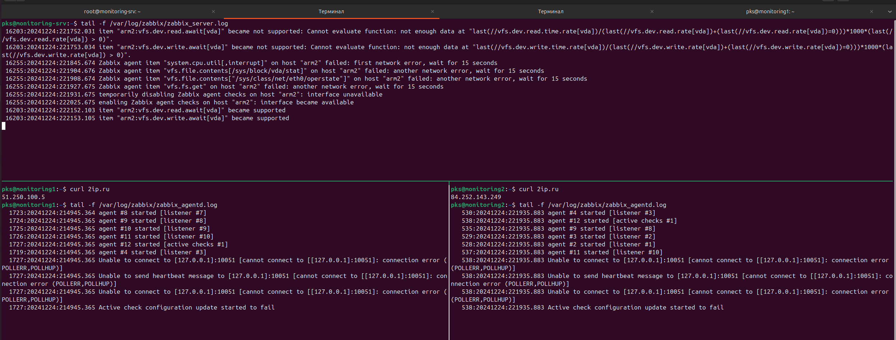

# Домашнее задание к занятию «Система мониторинга Zabbix» - `Политико Ксения`

---
### Задание 1
Установите Zabbix Server с веб-интерфейсом.

---

### Задание 2

Установите Zabbix Agent на два хоста.

